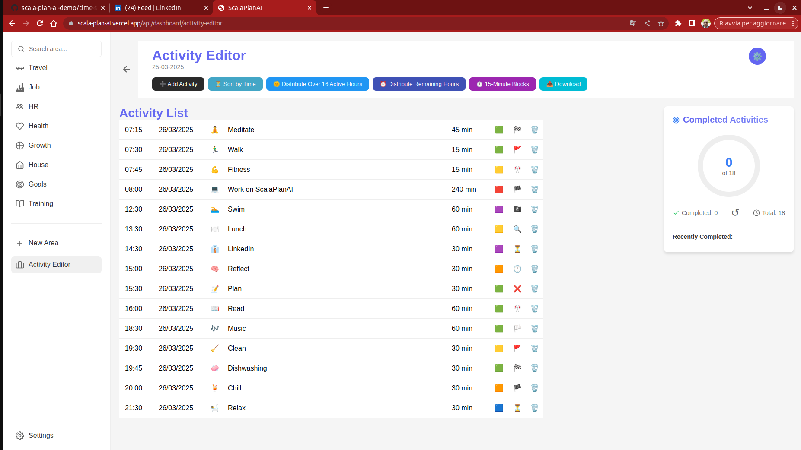

# 🪜 Demo of Scala-Plan-AI (MVP)

*Greetings from Edoardo Consulting!* 😊

## Latest Demo (25-03-25)

### Migration - first demo

**Scala-Plan-AI** is an advanced task planning and management application initially developed in **Scala** and later adapted into a simplified version in **Node.js + Vanilla JS**. The version we are presenting is an **MVP - (Minimum Viable Product)**, designed to showcase the core features, gather feedback, and guide future development.

You can access the **live demo** by clicking the link below:
👉 [**Demo of Scala-Plan-AI**](https://scala-plan-ai.vercel.app/)

### Interactive Themes  
- **Well-being 🌱**  
  A theme designed to promote serenity and mental well-being, with natural and gentle colors that foster a balanced and productive environment.

- **Darknight 🌙**  
  A dark theme optimized to reduce eye strain in low-light environments, perfect for evening use.

- **Daylight 🌞**  
  A light theme designed to improve visibility during the daytime, offering a fresh and clean interface, ideal for reading and organizing.

### RFC 9512 - Official YAML Media Type  
Starting from February 14, 2024, RFC 9512 formally registered **application/yaml** as the media type for all YAML content, introducing **+yaml** as the standard structured syntax suffix.

### Key Features  
- **Intelligent Task Management**  
  - CRUD operations for tasks  
  - Smart task distribution (7:00 AM - 11:00 PM)  
  - Micro-scheduling in 15-minute blocks  
  - Toast notifications for user feedback  

- **Area Creation and Management**  
  - Each area represents a related group of tasks  
  - Add, modify, and remove tasks for each area  
  - In the future, areas will be linked to daily tasks to track progress  

- **Advanced Logging System**  
  - Viewing and managing task progress through an advanced logging system  
  - Smooth and customizable user interface  

### Roadmap (in Quarters)  

**- Q1 2025** - Migration and MVP Demo Online:
Migration from the Scala-based system to a simplified version with Node.js + Vanilla JS. The goal is to showcase a live demo with basic features, allowing intelligent task management and a clean, functional user interface. In this simplified version, data will be managed through browser localstorage, without persistence in a central database. This version is intended to demonstrate the concept and gather useful feedback for future development.

**- Q2 2025** - Area Management and Progress Monitoring:
Introduction of the area monitoring system, with the ability to link each area to daily tasks. Users will be able to view the progress of each area in real time.

**- Q3 2025** - Task Automation and Optimization:
Implementation of an advanced automation system for task management, with the ability to assign automatic priorities and deadlines to improve efficiency.

**- Q4 2025** - Artificial Intelligence for Monitoring and Productivity:
Development of artificial intelligence features to suggest optimized tasks based on daily progress and user habits, to maximize productivity.

**- Q5 2025** - Database Server Integration:
Adding data persistence through the integration of a database server to ensure that information is securely stored and no longer reliant on browser localstorage. Data can be synchronized, and users can be managed centrally.

---

### Documentation
- [Development Time Log](time-spent-log.md)
- [Report](report.md)

## Features and Updates

### February 2025
- Rewritten the new development of the Roadmap
- Started Migration to simplified version using Node.js + Vanilla JS
- Implemented Areas functionality (demo section using local storage only)
- Continued development of Roadmap

### December 2024 - January 2025
- Implemented language switching functionality with new JavaScript helper
- Implemented theme toggling functionality with new JavaScript helper
- Added dark-light theme toggle
- Implemented quantum sub-menu system
- Added login/logout page with dark-light theme toggle
- Added undo functionality for completed activities
- Enhanced code organization and commenting
- Improved drag-and-drop interface
- Integrated completedActivitiesTracker with counter updates

---

## Why Scala?

Scala was chosen for its unique advantages:

1. **Power and Conciseness**
   - Robust Java integration with modern syntax
   - Reduced error risk through readable code

2. **Scalability**
   - Built for distributed systems
   - Full Java ecosystem compatibility

3. **Technical Innovation**
   - Static typing support
   - Hybrid OOP/functional programming

4. **Development Efficiency**
   - Native SBT integration
   - Reactive programming support via Akka

5. **Future-Ready**
   - Big Data compatibility (Spark)
   - Machine Learning capabilities
   - Strategic value for modern development

---
